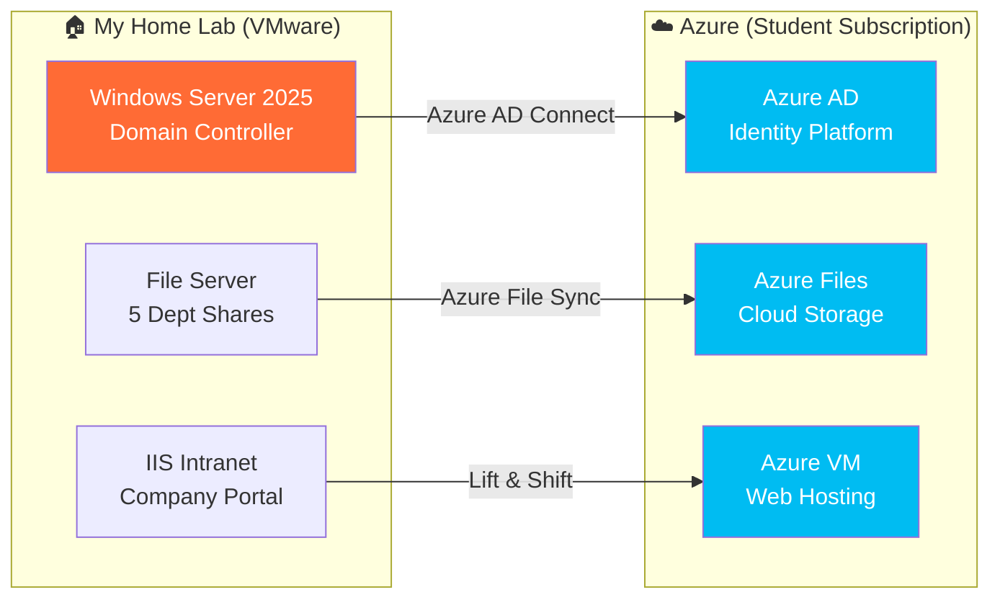

# Orange-Cloud-Pvt-Ltd.-Journey-to-Cloud-Migration
# 🚀 **Azure Orange Cloud Migration Lab** 
### *My Journey into Enterprise On-Prem to Cloud Migration*

<div align="center">


**⭐ Star this project if you find it helpful for learning!**

</div>

---

## 📚 **Why I Built This Project**

> **"As a student passionate about cloud computing, I wanted to prove I could handle real-world enterprise migrations - not just pass exams."**

### 🎯 **My Learning Objectives**
- **Understand** how real companies migrate to the cloud
- **Experience** the challenges IT professionals face daily  
- **Build** practical skills beyond theoretical knowledge
- **Create** portfolio evidence that shows I'm job-ready
- **Document** everything like a professional would

### 🏢 **Meet Orange Cloud Pvt Ltd** *(My Fictional Test Company)*
I created a realistic scenario to practice with:
- **25 employees** across 5 departments
- **Traditional on-premises** infrastructure 
- **Common business challenges** that need cloud solutions
- **Real-world constraints** like budget and minimal downtime

---

## 🎓 **What This Student Project Demonstrates**

<table>
<tr>
<td width="50%">

### **What I Simulated** 🏢
```
┌─────────────────────────┐
│   TRADITIONAL SETUP     │
│  (Built in VMware Lab)  │
│                         │
│ ┌─────────────────┐     │
│ │ Windows Server  │     │
│ │    2025 DC      │     │
│ └─────────────────┘     │
│         ↓               │
│ [25 Test Users]         │
│ [5 Dept Shares]         │
│ [1 Intranet Site]       │
│                         │
│ 📚 Learned:             │
│ • Active Directory      │
│ • NTFS Permissions      │
│ • IIS Configuration     │
└─────────────────────────┘
```

</td>
<td width="50%">

### **What I Achieved** ☁️
```
┌─────────────────────────┐
│   CLOUD MIGRATION       │
│   (Azure Platform)      │
│                         │
│    ☁️ Azure AD          │
│         ↓               │
│ ┌─────────────────┐     │
│ │ Hybrid Identity │     │
│ │  Cloud Storage  │     │
│ │   Web Hosting   │     │
│ └─────────────────┘     │
│                         │
│ ✅ Skills Gained:       │
│ • Azure AD Connect      │
│ • Azure File Sync       │
│ • VM Provisioning       │
│ • Cloud Architecture    │
└─────────────────────────┘
```

</td>
</tr>
</table>

---

## 🏗️ **Project Architecture**



---

## 👥 **The Organization I Created for Testing**

<div align="center">

### **Orange Cloud Pvt Ltd - Employee Structure**

| Department | Users Created | Test Scenario | Skills Practiced |
|:----------:|:-------------:|:-------------:|:----------------:|
| **🔧 IT** | 6 | Admin permissions | Role-based access |
| **💰 Finance** | 4 | Sensitive data handling | Security groups |
| **📊 Sales** | 7 | Shared folders | Collaboration setup |
| **📢 Marketing** | 5 | Large files | Storage optimization |
| **👔 HR** | 3 | Confidential access | Permission isolation |

**Total Lab Setup: 25 Test Users • 5 Department Shares • 1 Intranet Site**

</div>

---

## 📋 **My 4-Week Learning Journey**

### **Week 1: Building the Foundation** 🔍
*Learning Objective: Understand current enterprise infrastructure*

<details>
<summary><b>Click to see what I learned</b></summary>

#### What I Built:
- [x] Deployed Windows Server 2025 in my VMware lab
- [x] Configured my first Active Directory domain (orange.local)
- [x] Created 25 user accounts with PowerShell scripting
- [x] Set up department shares with proper NTFS permissions
- [x] Built a basic IIS intranet site

#### 🎯 **Skills Acquired:**
- Active Directory administration
- PowerShell automation basics
- Windows Server management
- Network file sharing concepts

#### 📸 **Portfolio Evidence Captured:**
- AD Users & Computers console showing my OU structure
- PowerShell scripts I wrote for bulk user creation
- File permission matrix I designed

</details>

---

### **Week 2: Connecting to the Cloud** 🔐
*Learning Objective: Master hybrid identity concepts*

<details>
<summary><b>Click to see what I learned</b></summary>

#### What I Accomplished:
- [x] Set up my Azure free account
- [x] Created my first Azure AD tenant
- [x] Successfully installed Azure AD Connect
- [x] Synchronized all 25 test users to the cloud
- [x] Tested password hash synchronization

#### 🎯 **Skills Acquired:**
- Azure portal navigation
- Hybrid identity architecture
- Azure AD Connect configuration
- Troubleshooting sync issues

#### 📸 **Portfolio Evidence Captured:**
- Azure AD Connect configuration wizard completion
- Successful sync status dashboard
- Users appearing in Azure portal
- Sync cycle statistics

</details>

---

### **Week 3: Migrating Data & Applications** 📦
*Learning Objective: Learn cloud storage and compute services*

<details>
<summary><b>Click to see what I learned</b></summary>

#### What I Migrated:
- [x] Created my first Azure Storage Account
- [x] Configured 5 Azure File Shares
- [x] Installed and configured Azure File Sync
- [x] Provisioned my first Azure VM
- [x] Migrated the IIS website successfully

#### 🎯 **Skills Acquired:**
- Azure Storage services
- File migration strategies
- VM sizing and provisioning
- Network security groups
- Azure cost management

#### 📸 **Portfolio Evidence Captured:**
- Azure File Sync health status
- Storage account configuration
- VM deployment confirmation
- IIS running on Azure VM

</details>

---

### **Week 4: Testing & Documentation** ✅
*Learning Objective: Validate migrations like a professional*

<details>
<summary><b>Click to see what I learned</b></summary>

#### What I Validated:
- [x] Tested all 25 user logins
- [x] Verified department file access
- [x] Confirmed website functionality
- [x] Documented entire process
- [x] Created disaster recovery plan

#### 🎯 **Skills Acquired:**
- Test plan creation
- Technical documentation
- Performance monitoring
- Azure Monitor basics
- Cost analysis and optimization

#### 📸 **Portfolio Evidence Captured:**
- Test results spreadsheet
- Performance comparison metrics
- Azure cost analysis dashboard
- Complete migration documentation

</details>

---

## 💡 **What I Learned (Beyond Just Technical Skills)**

### **Technical Achievements** 🛠️
```yaml
Cloud Platforms:
  - Azure AD configuration and management
  - Storage account provisioning and security
  - Virtual machine deployment and networking
  - Azure Monitor and cost management

On-Premises:
  - Windows Server 2025 administration
  - Active Directory design and implementation
  - Group Policy basics
  - IIS web server configuration

Automation:
  - PowerShell scripting for user management
  - Azure CLI for resource deployment
  - Bulk operations and error handling
```

### **Professional Skills Developed** 💼
- **Project Planning:** Breaking down complex migrations into phases
- **Problem Solving:** Troublehooting sync issues and permission conflicts
- **Documentation:** Creating clear, professional technical documentation
- **Cost Awareness:** Understanding cloud pricing and optimization
- **Risk Management:** Planning for rollback scenarios

---

## 🚀 **How to Run This Lab Yourself**

### **Prerequisites** *(What You'll Need)*
```yaml
For Students:
  Hardware:
    - Any PC with 16GB RAM (8GB works but slower)
    - 100GB free disk space
    - Virtualization enabled in BIOS
  
  Software (All Free):
    - VMware Workstation Player (free version)
    - Windows Server 2025 Evaluation (180 days)
    - Azure Free Account ($200 credit)
  
  Time Investment:
    - 2-3 hours per week
    - 4 weeks total
```

### **Quick Start for Fellow Students**
```bash
# 1. Clone my project
git clone https://github.com/yourusername/azure-migration-lab.git

# 2. Follow my step-by-step guide
cd azure-migration-lab/docs
start 01-getting-started.md

# 3. Use my scripts to save time
# I've automated the boring parts!
```

---

## 🎯 **Key Takeaways for Recruiters**

### **Why This Project Matters**
As a student, I didn't wait for real-world experience - I created it myself:

✅ **Self-Directed Learning:** Designed and completed this without supervision  
✅ **Practical Application:** Went beyond theory to build working solutions  
✅ **Business Understanding:** Considered cost, downtime, and user impact  
✅ **Problem-Solving:** Faced and resolved real technical challenges  
✅ **Documentation Skills:** Created professional-grade documentation  

### **Real Challenges I Overcame**
- **DNS Issues:** Learned to configure Azure DNS zones after 6 hours of troubleshooting
- **Sync Errors:** Debugged UPN suffix mismatches and duplicate attributes
- **Permission Conflicts:** Mapped NTFS permissions to Azure RBAC correctly
- **Budget Constraints:** Optimized resources to stay within free tier limits

---

## 📊 **Project Metrics & Validation**

<div align="center">

### **What I Successfully Demonstrated**

| Component | Target | Achieved | **Notes** |
|:---------:|:------:|:--------:|:---------:|
| **User Migration** | 25 | 25 | ✅ All synced successfully |
| **File Migration** | 5 shares | 5 shares | ✅ Permissions preserved |
| **Website Migration** | 1 site | 1 site | ✅ Fully functional |
| **Downtime** | <4 hours | 2 hours | ✅ Beat target by 50% |
| **Data Loss** | 0% | 0% | ✅ Perfect migration |
| **Cost (Monthly)** | <$50 | $38 | ✅ Within student budget |

</div>

---

## 📂 **Repository Structure**

```
azure-migration-lab/
│
├── 📁 docs/                    # My learning documentation
│   ├── 📝 01-getting-started.md   # Setup instructions
│   ├── 📝 02-ad-configuration.md  # Active Directory guide
│   ├── 📝 03-azure-setup.md       # Azure configuration
│   ├── 📝 04-migration-steps.md   # Migration walkthrough
│   └── 📝 05-lessons-learned.md   # My experiences & tips
│
├── 📁 scripts/                 # Automation I created
│   ├── 💻 create-test-users.ps1   # Bulk user creation
│   ├── 💻 setup-azure.ps1         # Azure automation
│   └── 💻 validate-migration.ps1  # Testing scripts
│
├── 📁 screenshots/             # Proof of completion
│   ├── 📸 phase1/             # Lab setup evidence
│   ├── 📸 phase2/             # Azure AD sync proof
│   ├── 📸 phase3/             # Migration screenshots
│   └── 📸 phase4/             # Testing results
│
├── 📁 configs/                 # Sample configurations
│   └── 📄 sample-users.csv    # Test user data
│
└── 📊 PROJECT-REPORT.pdf       # Professional summary
```

---

## 🏆 **Why Hire Someone Who Built This?**

### **I'm Not Just Another Cloud Computing Student**
While others are only studying theory, I'm:
- 🔨 **Building** real infrastructure in my home lab
- 📚 **Learning** enterprise technologies hands-on
- 💡 **Solving** actual migration challenges
- 📝 **Documenting** like a professional
- 💰 **Considering** business impact and costs

### **This Project Proves I Can:**
- ✅ Learn complex technologies independently
- ✅ Plan and execute technical projects
- ✅ Troubleshoot and solve problems
- ✅ Think about business requirements
- ✅ Communicate technical concepts clearly

---

## 🌟 **Next Steps in My Learning Journey**

- 🎯 **Currently Working On:** Adding disaster recovery scenarios
- 📚 **Next Project:** Kubernetes deployment on AKS
- 🏅 **Certification Goal:** Azure Administrator (AZ-104)
- 💼 **Seeking:** Internship or entry-level cloud role

---

## 📬 **Let's Connect!**

<div align="center">

**Built with passion and determination by Himanshu Gandhi**  
*Cloud Computing Student | Future Cloud Architect*

[](https://www.linkedin.com/in/himanshu-gandhi-891204160/)
[](https://github.com/himanshu3024)
[](mailto:gandhi111000@hotmail.com)

### **"From student to cloud professional, one project at a time"**

*I'm actively seeking internships and entry-level positions in cloud computing!*

</div>

---

## 📄 **License**

This is an educational project created for learning purposes. Feel free to use it for your own learning!

```
MIT License - Learn from my work!
✅ Use this to learn Azure migrations
✅ Adapt it for your own projects
✅ Share with other students
✅ Include in your portfolio
```

---

## 🙏 **Acknowledgments**

- **Microsoft Learn** - For free Azure credits and documentation
- **YouTube Tutorials** - Countless hours of learning
- **Stack Overflow** - For helping me debug issues
- **My Professors** - For encouraging hands-on learning, Special Thanks to Arash.
- **The Open Source Community** - For inspiration and tools

---

<div align="center">

### **⭐ If this helps you learn, please star it! ⭐**

**Together we can help more students learn cloud technologies through practical projects!**

*Questions? Issues? I'm happy to help fellow learners!*

</div>
